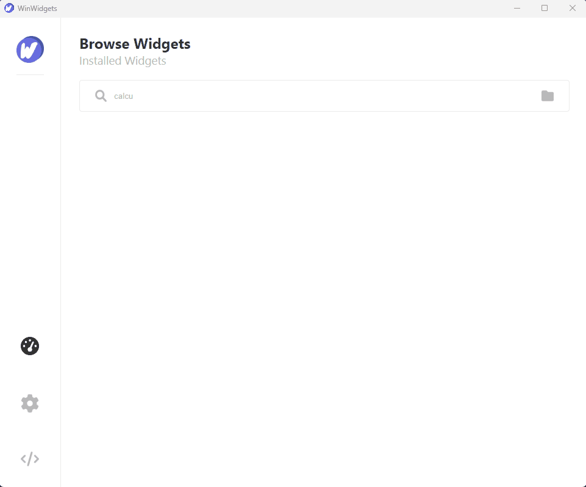
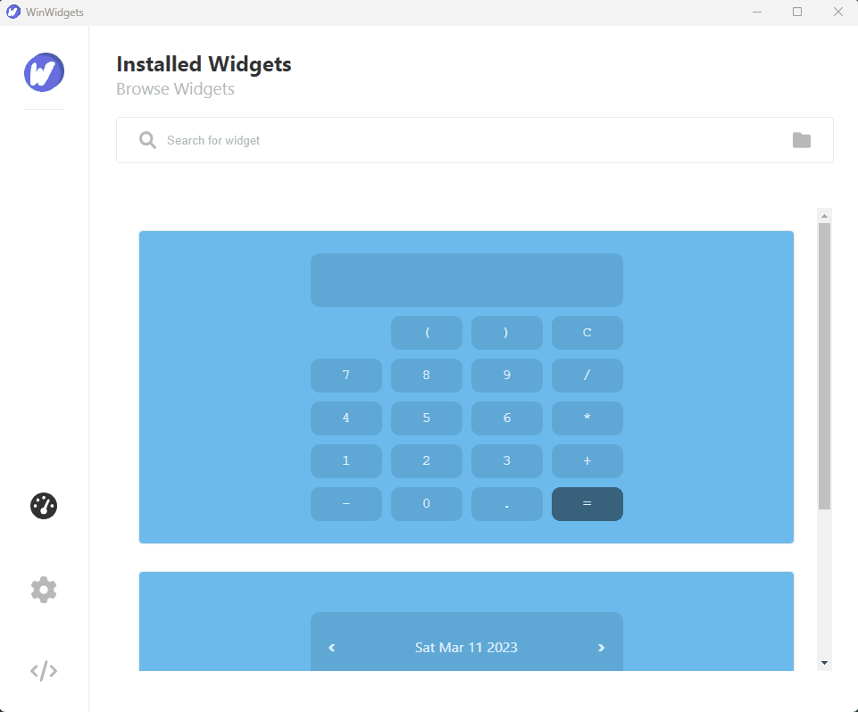

<div id="top"></div>

<p align="center">
  <a href="https://github.com/beyluta/WinWidgets">
    
  </a>
</p>

<!-- PROJECT LOGO -->
<br />
<div align="center">
  <a href="https://github.com/beyluta/WinWidgets">
    
  </a>

  <h3 align="center">WinWidgets</h3>

  <p align="center">
    Open-Source Widget application for Windows 10 and Windows 11
    <br />
    <br />
    <a href="https://github.com/beyluta/WinWidgets/issues">Report Bug</a>
    ·
    <a href="https://github.com/beyluta/WinWidgets/issues">Request Feature</a>
  </p>
</div>

<!-- ABOUT THE PROJECT -->

## About The Project

WinWidgets offers the possibility to create desktop widgets using HTML, CSS, and JavaScript for your Windows 10 or Windows 11 machine.

This is what makes this project interesting:

- 🧰 Focus on creating your widgets with all the usual web tools to your disposal
- 👆 Develop complex widgets using a high-level programming language (JS)
- 🖱️ Develop your widgets from anywhere then simply drag and drop to easily port it over
- ⌨️ Have better control over your widget's window with built-in front-end tags

## Screenshots and usage

#### Drag & Drop your widgets to install
   <br>

#### The settings panel will show you the version of the app and its settings
   <br>
   
#### Develop your own widgets easily. Find out more by navigating to the development panel
   <br>

### Built With

These are the technologies powering WinWidgets

- [Dotnet](https://dotnet.microsoft.com/en-us/)
- [Chromium](https://www.chromium.org/)
- [CefSharp](https://cefsharp.github.io/)

<!-- GETTING STARTED -->

## Getting Started

### Prerequisites

List of software required. Make sure all of these are installed

- Visual Studio 2022
- .NET Framework 4.7.2
- Microsoft Visual C++ 2015-2019

### Installation

1. Make sure the .NET Framework tools are installed in your version of Visual Studio (<b><i>NOT</i></b> .NET Core)
2. Clone the repo
   ```sh
   git clone https://github.com/beyluta/WinWidgets.git
   ```

<!-- CONTRIBUTING -->

## Contributing

1. Fork the Project
2. Create your Feature Branch (`git checkout -b feature/AmazingFeature`)
3. Commit your Changes (`git commit -m 'Add some AmazingFeature'`)
4. Push to the Branch (`git push origin feature/AmazingFeature`)
5. Add yourself to the CONTRIBUTORS.txt file
6. Open a Pull Request

<!-- LICENSE -->

## License

Distributed under the MIT License. See `LICENSE.txt` for more information.

<!-- CONTACT -->

## Contact

📎 Pedro Ribeiro - <a href="https://pedroribeiro.site">Portfolio</a>
<br>
📫 Email: beyluta1@gmail.com

<!-- ACKNOWLEDGMENTS -->

## Acknowledgments

Many thanks to these projects for their super useful resources 😄

- [Img Shields](https://shields.io)
- [Font Awesome](https://fontawesome.com)
- [HTML Agility Pack](https://html-agility-pack.net/)
- [Chromium](https://www.chromium.org/)
- [CefSharp](https://cefsharp.github.io/)
- [Json.NET](https://www.newtonsoft.com/json)
