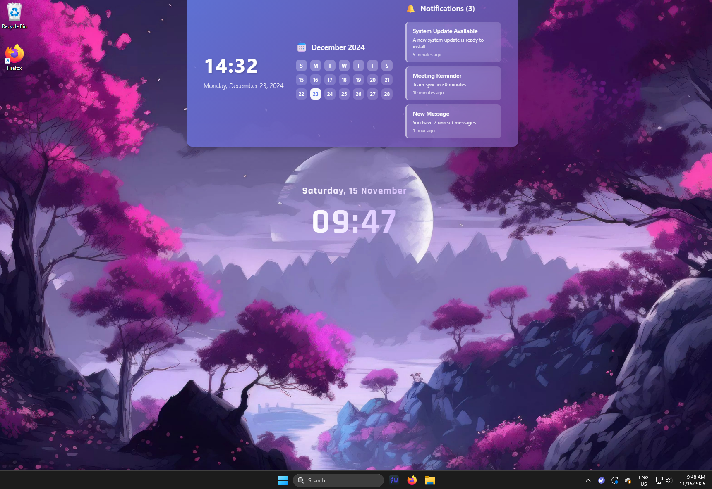
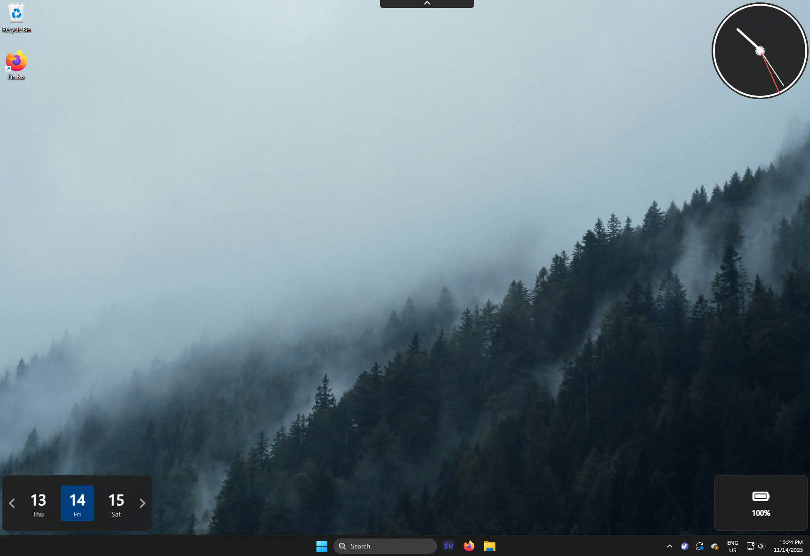
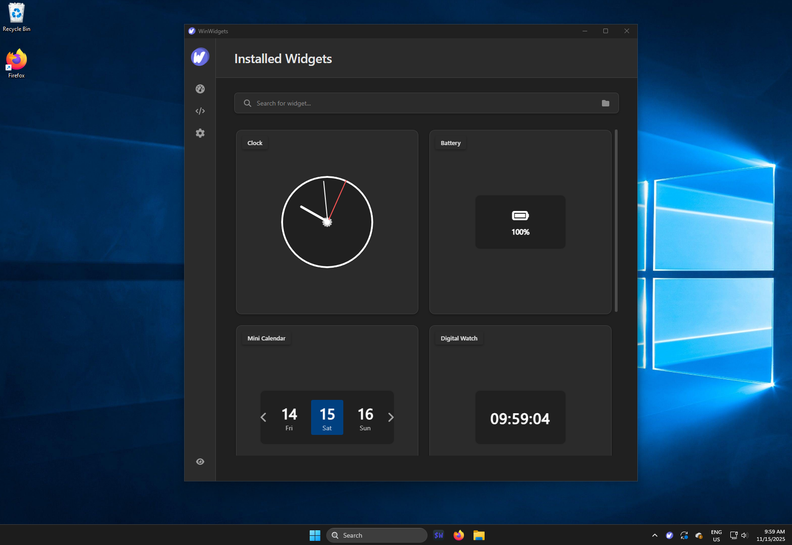

<p align="center">
  <a href="https://github.com/beyluta/WinWidgets">
    
  </a>
</p>

<br />
<div align="center">
  <a href="https://github.com/beyluta/WinWidgets">
    
  </a>

  <h3 align="center">WinWidgets</h3>
  <div align="center">
    &nbsp;
    
  </div>

  <p align="center">
    Open-Source Widget application for Windows and Linux
    <br />
    <br />
    <a href="https://github.com/beyluta/WinWidgets/issues">Report Bug</a>
    ·
    <a href="https://github.com/beyluta/WinWidgets/issues">Request Feature</a>
    ·
    <a href="https://github.com/beyluta/WinWidgets/discussions/40">Submit Widget</a>
  </p>
</div>

## About

**WinWidgets** makes web-based desktop widgets easy to develop.
Use a mix of `HTML`, `CSS`, and `JavaScript` to create your own widgets on the fly.

This is what makes this project interesting:

- 🧰 Focus on creating your widgets with all the usual web tools to your disposal.
- ⚙️ Develop complex widgets using JavaScript.
- 🖱️ Create your widgets from any tool or resource, then import it here.
- ⌨️ Listen to operating system events and act on them programmatically.

## Support

These are the platforms officially supported by WinWidgets.

| Platform | Availability | Supported Version |
| -------- | ------------ | ----------------- |
| Windows  | ✅           | Windows 11        |
| Linux    | ⚠️ (W.I.P)   | Arch              |
| MacOS    | ❌           | N/A               |

> The software may run on operating systems or distributions not
> listed here but it isn't guaranteed.

## Widget development

Inside the application, you will find a tab "development". It includes a guide about
widget development in WinWidgets.

You may also have a look in this repository under
`assets/resources/` for some sample Widgets:

```bash
/WinWidgets/
  | ...
  | assets/
    \_ resourcers/
        | ...
        | Clock.html
        | Calendar.html
        | Battery.html
```

## Screenshots







## Building

This is a brief guide for all supported platforms to compile and run the application.

### Windows prerequisites

Download the following dependencies for Windows 11 with the following
`Chocolatey` command. Optionally you can download them manually and put
in your PATH environment variable.

```bash
choco install mingw make llvm
```

### Linux prerequisites

For Linux you need the packages `cairo` and `webkitgtk-6.0`. Make sure to get their
corresponding `-dev` packages as well, else you won't be able to compile.

### Common commands

These are commands that work for all supported platforms.
Read them carefully to successfully compile the application.

When building for the first time you must run the following command to fetch dependencies:

```bash
git submodule update --init --recursive
```

(Optional) Consider running the following when pulling remote changes to update dependencies:

```bash
git submodule update --recursive --remote
```

Compile the binary for debugging with the following command:

```bash
make debug
```

Compile the binary for release with the following command:

```bash
make release
```

Execute the program with:

```bash
make run
```

## Contributing

1. Fork the Project
2. Create your Feature Branch (`git checkout -b feature/AmazingFeature`)
3. Commit your Changes (`git commit -m 'Add some AmazingFeature'`)
4. Push to the Branch (`git push origin feature/AmazingFeature`)
5. Add yourself to the CONTRIBUTORS.txt file
6. Open a Pull Request
