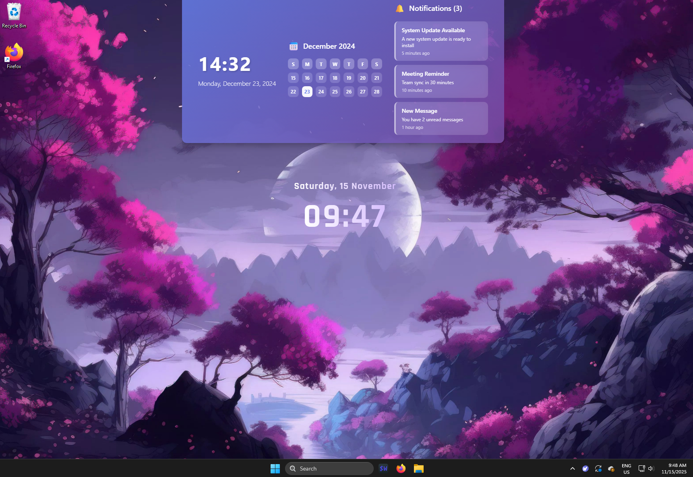
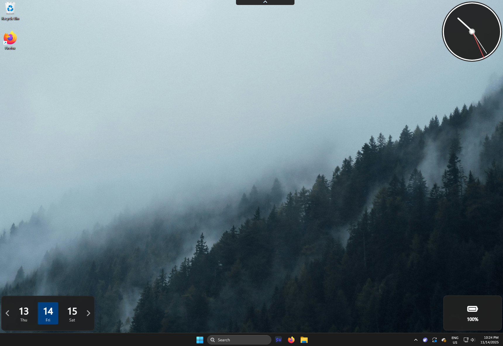
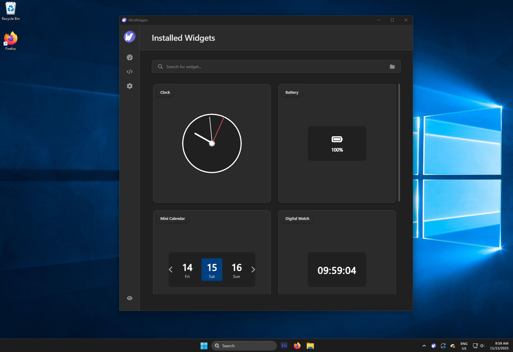

<p align="center">
  <a href="https://github.com/beyluta/WinWidgets">
    
  </a>
</p>

<br />
<div align="center">
  <a href="https://github.com/beyluta/WinWidgets">
    
  </a>

  <h3 align="center">WinWidgets</h3>
  <div align="center">
    &nbsp;
    
  </div>

  <p align="center">
    Open-Source Widget application for Windows and Linux
    <br />
    <br />
    <a href="https://github.com/beyluta/WinWidgets/issues">Report Bug</a>
    ·
    <a href="https://github.com/beyluta/WinWidgets/issues">Request Feature</a>
    ·
    <a href="https://github.com/beyluta/WinWidgets/discussions/40">Submit Widget</a>
  </p>
  
  <a href="https://www.buymeacoffee.com/beyluta" target="_blank"></a>
</div>

## About

**WinWidgets** makes web-based desktop widgets easy to develop.
Use a mix of `HTML`, `CSS`, and `JavaScript` to create your own widgets on the fly.

This is what makes this project interesting:

- Made by humans for humans; no vibe-coding.
- Focus on creating your widgets with all the usual web tools to your disposal.
- Develop complex widgets using JavaScript.
- Create your widgets using your preferred tools.
- Listen to native OS events and act on them programmatically.

## Support

These are the platforms officially supported by WinWidgets.

| Platform | Availability | Supported Version |
| -------- | ------------ | ----------------- |
| Windows  | ✅           | Windows 11        |
| Linux    | ✅           | Arch Linux        |
| MacOS    | ❌           | -                 |

> The software may run on operating systems or distributions not
> listed here but it isn't guaranteed.

---

### Feature Parity

Current status of widget features on supported platforms:

| Feature                 | Windows 11 | Linux | Status                  |
| ----------------------- | ---------- | ----- | ----------------------- |
| Opening widgets         | ✅         | ✅    | Working                 |
| Transparency            | ✅         | ✅    | Working                 |
| System functions        | ✅         | ⚠️    | Linux work in progress  |
| Restore widget position | ✅         | ⚠️    | Wayland technical block |
| Top most                | ✅         | ⚠️    | Wayland technical block |

---

### Linux Feature Limitations

Some features currently unavailable on Linux are not possible due to Wayland technical limitations:

- **Window restore position**: Not possible under Wayland.
- **Window top most**: Not possible under Wayland.

Wayland is a display server for Linux. Features blocked by Wayland architecture won't be technically possible on that platform.

## Screenshots







## Building

This is a brief guide for all supported platforms to compile and run the application.

---

### Windows prerequisites

**Required packages**: Download the following applications using Chocolatey

```bash
choco install git msys2 mingw make llvm
```

> If downloaded manually: `msys2` and `mingw` must be in the PATH environment variables.

**Dependencies**: After installing, open the MSYS2 terminal
application and install these dependencies

```bash
pacman -S mingw-w64-x86_64-curl mingw-w64-x86_64-libzip
```

**Verify installation**: `curl` and `libzip` **MUST** be installed by in
`C:/tools/msys64`. If this path is incorrect then update the
`MINGW64` variable in the makefile

```makefile
...
# ---------------------------------------------------------------------------
# Building for Windows platform
# ---------------------------------------------------------------------------
ifeq ($(OS), Windows_NT)
MINGW64 := C:/tools/msys64/mingw64
...
```

---

### Linux prerequisites

For Linux you need the packages `gtk-3.0`, `appindicator3` and `webkitgtk-4.1`.
Make sure to get their corresponding `-dev` packages as well or else you
won't be able to compile.

---

### Compiling the software

**Cloning**: Clone the repository

```bash
git clone https://www.github.com/beyluta/WinWidgets.git
```

**Fetch dependencies**: When building for the first time you must run the following command to fetch dependencies

```bash
git submodule update --init --recursive
```

**Build external dependencies**: Downloading and/or building required libraries

```bash
make prepare
```

> use `make prepare LLAMA_GPU_CUDA=ON` for NVIDIA GPU cards

**Compiling the software**: Building WinWidgets itself

```bash
make
```

> use `make LLAMA_GPU_LAYERS=99` to offload all layers to the GPU

## Contributing

> Using A.I for assistance or research is very welcome.
> Fully vibe-coded solutions will be rejected.

1. Fork the Project
2. Create your Feature Branch (`git checkout -b feature/AmazingFeature`)
3. Add yourself to the CONTRIBUTORS.txt file
4. Commit your Changes (`git commit -m 'Add some AmazingFeature'`)
5. Push to the Branch (`git push origin feature/AmazingFeature`)
6. Open a Pull Request
